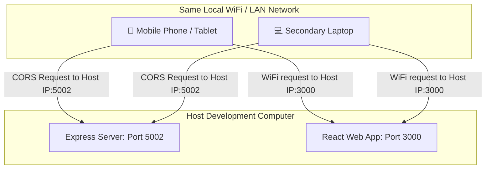

# 🌟 Benets Tours — Premium Luxury Travel & Tour Booking Platform

A comprehensive, state-of-the-art full-stack travel booking and content management platform engineered for **Benets Tours** (by Happy Land Group Ventures). Built using **React 19** with rich kinetic animations on the frontend, and a highly secure, auto-fallback **Node.js/Express** backend architecture on the server side.

---

## 🏛️ Project Architecture

The project is split into two cleanly separated main directory structures:

```
antiproj/
├── client/                 # React 19 Single Page Application (CRA)
│   ├── public/             # Static public assets
│   └── src/                # React source code
│       ├── admin/          # Admin dashboard sub-views
│       ├── api/            # Axios API config & interceptors
│       ├── components/     # Reusable layout and custom UI components
│       ├── context/        # React global context providers (Auth)
│       ├── pages/          # Full page views (Home, Tours, Dashboard, etc.)
│       └── styles/         # Global stylesheets & typography
│
└── server/                 # Express REST API Backend
    ├── config/             # DB and system configuration
    ├── controllers/        # Route controllers containing business logic
    ├── middleware/         # Security, Rate limits & Error handling
    ├── models/             # Mongoose/MongoDB data schemas
    ├── routes/             # API Router definitions
    ├── seed/               # Database seeder scripts
    ├── uploads/            # Server static file uploads & local storage
    └── utils/              # Helper utilities (Dual database layer)
```

---

## ✨ Core Features

### 🎨 1. Premium Interactive Client Interface
*   **Aesthetic Typography & Modern HSL Styling:** Curated premium dark-themed accents and responsive grid layouts designed to wow high-end clientele.
*   **Kinetic Micro-Animations:** Driven by **GSAP (GreenSock)** and **Framer Motion** for exquisite page entrance transitions and interactive elements.
*   **Buttery Smooth Scrolling:** Powered by **Lenis** scroll physics for an organic desktop user experience.
*   **High-Fidelity Showcases:** Utilizes **Swiper** for responsive touch-enabled slideshows of luxury tour destinations.

### 🛡️ 2. Dual Database Core with Seamless Fallback (Zero-Config Setup)
*   **Flexible DB Interceptors:** Uses a custom `dbHelper` database virtualization layer.
*   **Smart Fallback Mode:** If a local MongoDB instance is offline, the backend **transparently falls back to an auto-generated JSON Database (`server/uploads/local_db.json`)**.
*   **Instant Seeding:** On first boot in fallback mode, the backend auto-seeds 8 premium luxury tours, reviews, and test credentials. 
*   **Out-of-the-box Ready:** Perfect for local offline runs without requiring database administration or configuration!

### 📊 3. Absolute CRUD Admin Control
*   **All-In-One Dashboard:** Dedicated administrative interface providing full lifecycle management:
    *   **Tours CRUD:** Create, update, view, and delete detailed vacation packages (pricing, images, slot size, start dates).
    *   **Bookings Tracking:** Confirm, track, and monitor reservation requests.
    *   **Blog Engine:** Publish and update luxury travel stories and logs.
    *   **Testimonials & Reviews:** View ratings and feedback with real-time tour rating recalculations.
    *   **Landing Page Customizers:** Live updates for trust logos, reasons to travel, and brand assets.
    *   **Newsletter:** Gather and manage marketing email lists.

### 🔒 4. Enterprise-Grade Security
*   **Bcrypt Password Encryption:** Robust cryptographic hashing for secure user access control.
*   **Double-Layer JWT (JSON Web Tokens):** Access tokens paired with request interceptors to auto-expire sessions.
*   **API Protection:** Configured with **Helmet** to protect headers, **CORS** restrictions (protecting ports `3000`/`3001`), and **Express Rate Limiters** to guard against brute-force and DDoS attempts.

---

## 🛠️ Technology Stack

| Component | Technology | Description |
| :--- | :--- | :--- |
| **Frontend Core** | React 19.2 | Modern, performance-focused component views |
| **Routing** | React Router Dom 7.15 | Advanced client-side nested routing |
| **Animations** | GSAP 3.15 + Framer Motion 12.39 | Premium interactive visuals & transitions |
| **Scroll Engine** | Lenis 1.3 | Custom smooth inertia scrolling |
| **API Client** | Axios 1.16 | Promise-based HTTP requests with interceptors |
| **Backend Framework** | Node.js + Express 4.19 | Fast, minimalist RESTful API shell |
| **Security Layer** | Helmet 7.1 + Express Rate Limit | Robust header shielding & API rate-limiting |
| **Primary Database** | MongoDB + Mongoose 8.3 | Elegant object data modeling |
| **Fallback Database** | Local JSON Store (Custom Node FS) | Transparent file-based fallback database |

---

## 🔑 Default Test Credentials

On system launch, the backend seeds the following accounts (valid for both **MongoDB** and **Local JSON Fallback** databases):

| Role | Email | Password |
| :--- | :--- | :--- |
| 🛡️ **Administrator** | `admin@happygroupventures.com` | `password123` |
| 🧳 **Standard Traveler** | `guest@happygroupventures.com` | `password123` |

---

## ⚡ Quick Start Guide

Follow these simple steps to spin up the entire application locally in minutes:

### 1. Prerequisite Installations
*   Ensure [Node.js](https://nodejs.org/) (v16.0 or higher) is installed.
*   *(Optional)* Local or Atlas [MongoDB](https://www.mongodb.com/) instance. If not present, the system will use the JSON database fallback.

### 2. Set Up the Server Backend
```bash
# Navigate to server directory
cd server

# Install dependencies
npm install

# Create environment configuration (optional)
cp .env.example .env     # If .env.example exists, or let default .env stand

# Run in Development Mode with Nodemon
npm run dev
```

### 3. Set Up the Client Frontend
```bash
# Open a new terminal and navigate to client directory
cd client

# Install dependencies
npm install

# Run the React developer server
npm start
```
*   Your web browser will automatically open [http://localhost:3000](http://localhost:3000) to display the gorgeous Benets Tours UI!

---

## 📱 Local Network & Multi-Device Testing Guide

To test or demonstrate the application on other devices in your local network (e.g., **Smartphones, Tablets, or other Laptops**), follow this detailed setup. This is vital since other devices cannot use `localhost` to connect to your computer.

### 🗺️ Conceptual Overview


---

### Step 1: Find Your Host Computer's Local IP Address
Both your host computer (running the servers) and the other devices must be connected to the **same Wi-Fi network**.

*   **On macOS:**
    1. Open **System Settings** > **Wi-Fi**.
    2. Click on the **Details** button next to your connected network.
    3. Note your IP address (usually starts with `192.168.x.x` or `10.x.x.x`, e.g., `192.168.1.15`).
    *Alternative (Terminal):* Run `ipconfig getifaddr en0` or `ifconfig | grep "inet "`.
*   **On Windows:**
    1. Open **Command Prompt** (`cmd`).
    2. Run `ipconfig`.
    3. Look for **IPv4 Address** under your active wireless or ethernet adapter (e.g., `192.168.1.15`).

---

### Step 2: Configure Server CORS (Cross-Origin Resource Sharing)
Since other devices will access your client on `http://<YOUR_HOST_IP>:3000`, the Express backend needs to permit incoming requests from that address.

1. Open [server/app.js](file:///Users/codecarrots/Desktop/antiproj/server/app.js) in your text editor.
2. Locate the CORS middleware configuration (around line 25-29):
   ```javascript
   app.use(cors({
     origin: ['http://localhost:3000', 'http://127.0.0.1:3000', 'http://localhost:3001', 'http://127.0.0.1:3001'],
     credentials: true
   }));
   ```
3. Add your host IP address to the allowed origins array:
   ```javascript
   app.use(cors({
     origin: [
       'http://localhost:3000', 
       'http://127.0.0.1:3000', 
       'http://localhost:3001', 
       'http://127.0.0.1:3001',
       'http://192.168.1.15:3000' // <-- Add your Host IP address here!
     ],
     credentials: true
   }));
   ```
4. Save the file. The Nodemon server will restart automatically.

---

### Step 3: Run the Frontend Client with Your Local IP Address
By default, the React client attempts to hit the API at `localhost:5002`. On a secondary device like a phone, `localhost` points to the phone itself, so requests will fail. You must tell the client to point to the host computer's IP instead.

Launch the React developer server using an environment variable specifying your Host IP:

*   **On macOS / Linux (Terminal):**
    ```bash
    cd client
    REACT_APP_API_URL=http://192.168.1.15:5002/api npm start
    ```
*   **On Windows (Command Prompt - cmd):**
    ```cmd
    cd client
    set REACT_APP_API_URL=http://192.168.1.15:5002/api&&npm start
    ```
*   **On Windows (PowerShell):**
    ```powershell
    cd client
    $env:REACT_APP_API_URL="http://192.168.1.15:5002/api"; npm start
    ```

*React will launch the client. The terminal will display:*
```text
On Your Network:  http://192.168.1.15:3000
```

---

### Step 4: Access and Interact on the Other Device
1. Open the web browser (e.g., Safari, Chrome) on your mobile phone or secondary device.
2. Enter the **On Your Network** address displayed in the terminal:
   `http://192.168.1.15:3000`
3. The premium luxury travel interface will load fully, and you can log in, book tours, write reviews, and browse the admin dashboard directly from the secondary device!

---

### ⚠️ Network Troubleshooting Checklist
If you cannot load the page or if network requests fail:
1. **Check WiFi Connection:** Ensure both devices are on the **exact same** Wi-Fi network or SSID. (Some dual-band routers isolate 2.4GHz and 5GHz bands; make sure they are on the same band).
2. **Disable Firewall Blocks:**
   * **macOS:** Check **System Settings** > **Network** > **Firewall** and temporarily allow incoming Node connections.
   * **Windows:** Adjust Windows Defender Firewall settings to allow Node.js (or port 3000/5002) through private networks.
3. **Verify Host IP Changes:** Local IP addresses can change when reconnecting to Wi-Fi. Always check `ifconfig` / `ipconfig` if it stops working after a router reboot.

---

## ⚙️ Environment Configuration

### Server Backend (`server/.env`)
The server works flawlessly out of the box, but you can customize the configuration in your `.env` file:
```env
PORT=5002                                        # Network port for backend (Default: 5002)
NODE_ENV=development                            # Deployment mode (development/production)
MONGO_URI=mongodb://127.0.0.1:27017/happylandtours # MongoDB Connection URI
JWT_SECRET=happyland_luxury_secret_123           # Key for JWT Token Generation
JWT_REFRESH_SECRET=happyland_luxury_refresh_... # Key for session renewal
```

---

## 📡 REST API Endpoint Reference

### 🔐 Authentication
*   `POST /api/auth/register` - Create a new traveler account
*   `POST /api/auth/login` - Authenticate and obtain JWT
*   `GET /api/auth/me` - Fetch details of the currently logged-in user *(Requires Token)*

### ✈️ Tours Packages
*   `GET /api/tours` - Retrieve tours (includes text search, pagination, and HSL price/distance filtering)
*   `GET /api/tours/:id` - Fetch details of a single tour
*   `POST /api/tours` - Create a new luxury package *(Admin Only)*
*   `PUT /api/tours/:id` - Edit tour details *(Admin Only)*
*   `DELETE /api/tours/:id` - Remove a tour package *(Admin Only)*

### 📅 Booking Engine
*   `POST /api/bookings` - Submit a new tour reservation *(Requires Token)*
*   `GET /api/bookings` - Fetch your bookings (Standard user) or track all client bookings *(Admin Only)*
*   `GET /api/bookings/:id` - Retrieve details of a booking
*   `PUT /api/bookings/:id` - Update reservation status (confirm/cancel) *(Admin Only)*

### 📝 Blogs, Reviews & Extras
*   `GET /api/blogs` - Fetch travel articles
*   `POST /api/blogs` - Publish a new article *(Admin Only)*
*   `POST /api/reviews` - Post a traveler review for a tour *(Requires Token)*
*   `GET /api/newsletter` - View subscribers *(Admin Only)*
*   `POST /api/newsletter` - Subscribe to marketing emails
*   `GET /api/settings` - Retrieve site customization configurations
*   `PUT /api/settings` - Save general site settings *(Admin Only)*

---

## 🛠️ Main Development Scripts

### Client Directory (`/client`)
*   `npm start` - Launches local Webpack Dev server on port 3000
*   `npm run build` - Standard production bundler compilation
*   `npm test` - Executes unit test cases

### Server Directory (`/server`)
*   `npm run dev` - Launches backend server with Nodemon (live reload on save)
*   `npm start` - Standard production Node execution
*   `npm run seed` - Re-seeds database with luxury tour catalog packages

---

Developed with absolute attention to premium design and technical scalability for **Benets Tours & Happy Land Group Ventures**. 🌴✈️
